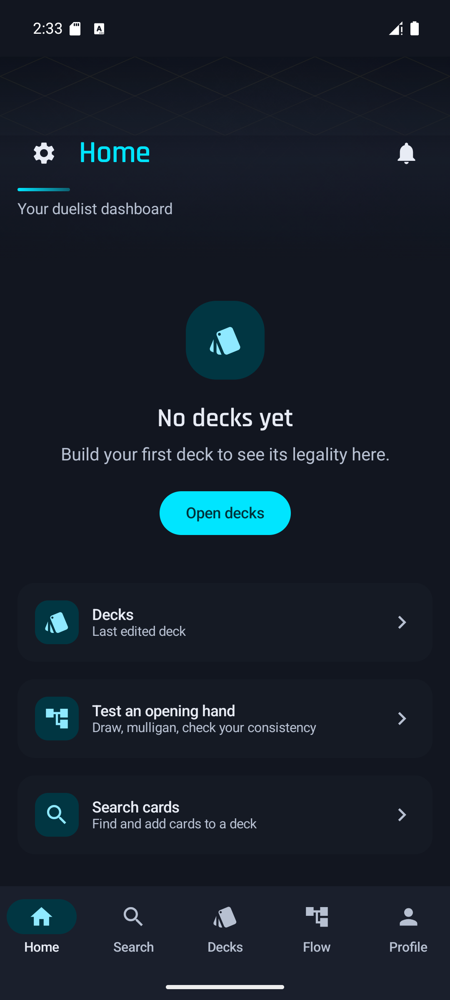
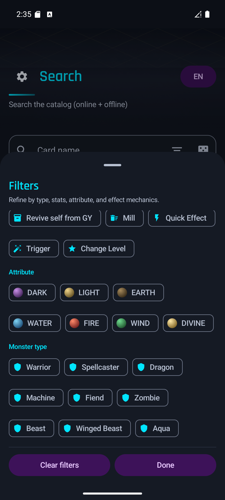
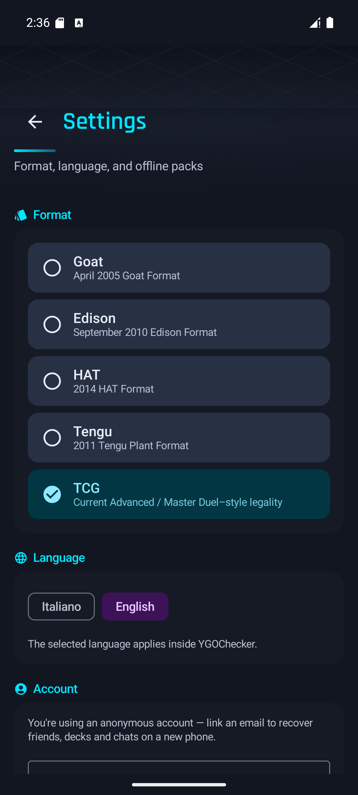

  

<h1 align="center">YGOChecker</h1>

  Native Android companion for Yu-Gi-Oh! deck building — search the catalog, check format legality, test opening hands, and share decks with friends. Free and open source.

  
  
  

## Download

**[⬇ Download the latest APK](https://github.com/Danny4897/YGO-CardChecker-Mobile/releases/latest/download/app-release.apk)**

Sideloaded FOSS build — Android will show a Play Protect warning on first install since it isn't Play Store-distributed; this is expected for all sideloaded apps, not specific to this one. The app checks for updates on launch and installs them in place, so you only download manually once. See [`android/distribution/README.md`](android/distribution/README.md) for how the update feed works.

Requires Android 8.0 (API 26) or newer.

## Screenshots

| Home | Search filters | Settings |
|---|---|---|
|  |  |  |

## Features

- **Catalog search** — full card database, online + offline, with filters for type, level/rank, ATK/DEF range, attribute, monster race, and effect mechanics (special summon, negate, GY effects, and more)
- **Format legality** — TCG, GOAT, Edison, HAT, and Tengu Plant formats, checked per-card and per-deck
- **Deck building** — Main/Extra/Side editor, text-list and YDKE import/export, save cards straight from search into a deck
- **Hand testing** (Flow) — simulate opening hands, mulligans, and consistency across your deck
- **Social** — friends, public deck sharing, chat and DMs, backed by a self-hosted Supabase project
- **Offline-first** — the card catalog, legality data, and effect scripts sync locally so search and legality checks work without a connection
- **FOSS auto-update** — no Play Store dependency; the app polls GitHub Releases (with CDN mirrors) for new versions

## Tech stack

Kotlin, Jetpack Compose, Material 3, Hilt, Room, DataStore, Coroutines/Flow, Coil, Retrofit/OkHttp. See [`android/README.md`](android/README.md) for architecture, module layout, and build instructions from source.

## Contributing

Issues and pull requests welcome. If you're changing the Android app, read `android/README.md` first for the module structure and `android/distribution/README.md` before touching anything release-related — the update feed has a couple of non-obvious constraints (signing key stability, multi-mirror CDN) that are easy to break by accident.
