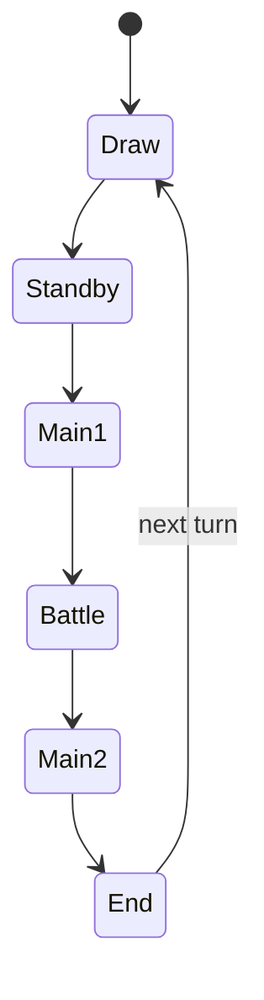

# Battle Simulation — Architecture

## Layers

```
models/battle/          → pure types
services/battle/*.ts      → pure engine (no Angular)
services/battle/*.service.ts → thin Angular facades
features/battle/stores/   → signals store
features/battle/pages/    → route page
features/battle/components/ → field UI
```

## State model



Each `PlayerState` holds: LP, hand, deck, GY, 5 monster zones, 5 S/T zones, field spell.

`CardInstance` is runtime copy with `instanceId`, zone, position, flags.

## Effect pipeline

1. User selects card in hand/field
2. `CardKnowledgeIndexService` → `effects[]` for `cardId`
3. `effect-interpreter` checks preconditions vs `DuelState`
4. Returns `EffectAction[]` (executable or blocked with `errorKey`)
5. `battle-engine` applies action → new immutable `DuelState`
6. Log entry with `knowledge.effect.*` i18n key

## Supported effect kinds (v1)

| Kind | Engine action |
|------|---------------|
| `control` | Gate: requires field state |
| `special_summon_deck` | Move matching card deck → field |
| `special_summon_gy` | GY → field |
| `add_from_deck` | Deck → hand |
| `tribute_summon` | Tribute + NS |
| `tribute_special_summon` | Tribute + SS |
| `self_summon_hand_tribute_atk` | Tribute by ATK + SS |
| `synchro_summon` | Placeholder log (v2) |
| `xyz_summon` | Placeholder log (v2) |

## UI layout

```
┌─────────────────────────────────────┐
│ Opponent LP │ Phase bar │ Player LP │
├─────────────────────────────────────┤
│        Opponent field (5+5)         │
│         ─── duel zone ───           │
│         Player field (5+5)          │
├─────────────────────────────────────┤
│ Hand (player) │ Action log          │
└─────────────────────────────────────┘
```

Reuses: `duel-panel`, `duel-field-bg`, `page-header`, `empty-state`.

## Non-goals (v1)

- Full TCG rule compliance (chains, SEGOC, timing)
- Master Rule 2020 edge cases
- Online multiplayer
